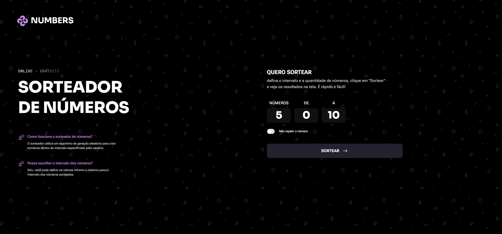
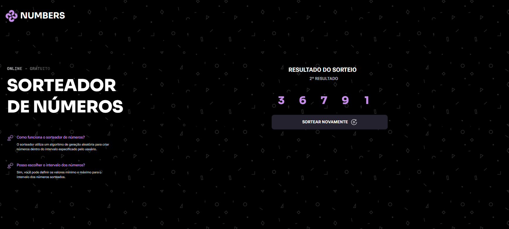
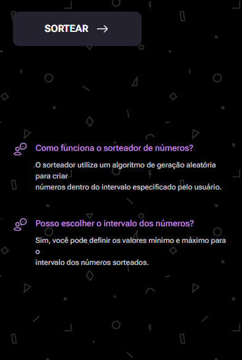
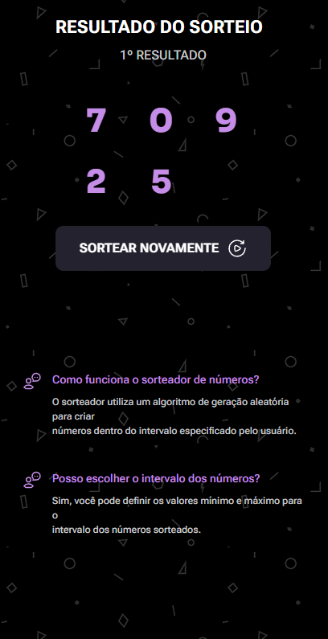

<h1 align="center" style="font-weight: bold;">NUMBER DRAWER💻</h1>

 <a href="#tech">Technologies</a> • 
 <a href="#started">Getting Started</a> • 

    <b>
      Random number generator used to train arrays, objects, promises, asynchronous functions and the new JavaScript Crypto API functionality, in addition to using regexp.
    </b>

     <a href="https://prizedrawn.netlify.app/">📱 Visit this Project</a>

<h2 id="layout">🎨 Layout Web</h2>

      
      

<h2 id="layout">🎨 Layout Mobile</h2>

      
      
      
      

<h2 id="tech">💻 Technologies</h2>

- HTML5
- CSS3
- JAVASCRIPT

<h2 id="started">🚀 Getting started</h2>

- Just download the project with its assets and run it with liveserve or just by opening the html document

